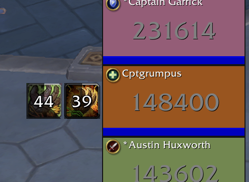

# PetesDefensiveHistory

Tracks cooldowns for Blizzard's "Center Big Defensive Buffs".

Which cooldown has been used is guessed based on the small number of buffs that Blizzard marks BIG_DEFENSIVE and additional logic about how those buffs work. Since no unsecreting explots are used, tracking cannot be 100% accurate and depends on the group composition. External defensives like Ironbark and Blessing of Sacrifice make the cooldown inference problem depend on the group composition. There are many limitations to the accuracy of the cooldown identification logic and there are still more ways to improve guessing.

STILL A WORK IN PROGRESS. Most notably, support to automatically identify talents that change cooldown length, buff duration or number of charges.

OmniCD-like tracking when cooldown can be accurately guessed

Group-wide detection of abilities and inference on which can be accurately guessed

