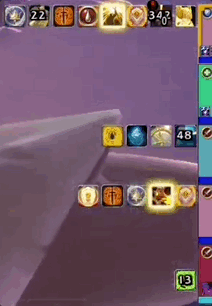
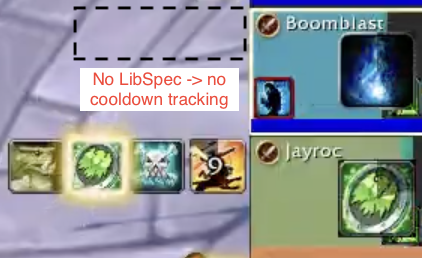
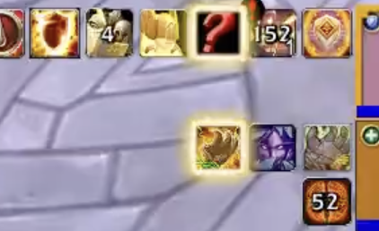
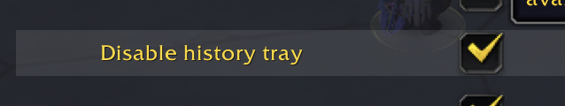
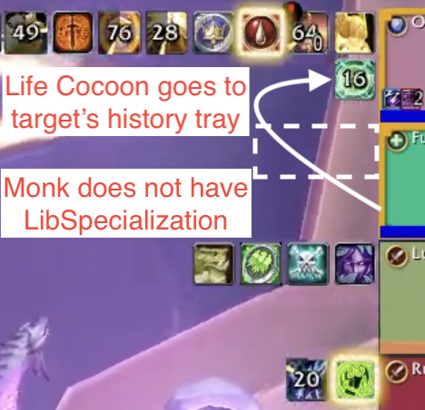

# PetesDefensiveHistory

**WHILE MOSTLY FUNCTIONAL, THIS ADDON IS STILL UNDER ACTIVE DEVELOPMENT. EXPECT SOME BUGS, INCONVENIENCES AND /reloads.**

 Help by reporting bugs and sharing logic export strings and combat logs!

Tracks cooldowns for Blizzard-approved `IMPORTANT`, `BIG_DEFENSIVE` and `EXTERNAL` buffs.
When identified, active cooldowns are glowed and cooldown timers are shown. Text-To-Speech (TTS) announcements are also supported. Buffs that cannot be identified are instead displayed on a second row similar to a GCD history tracker. These buffs display a "count-up" timer that indicates how much time has passed since that (unidentified) buff was applied.

PetesDefensiveHistory uses a flexible inference engine to identify abilities through several lines of evidence. Many abilities can be detected immediately on cast. In future versions, more abilities will be added.

* Tracks 61 offensive and defensive cooldowns.
* Detects talents and hero specs.
* Text-to-Speech (TTS) ability announcer.
* Supports DandersFrames, EnhanceQoL, Grid2, VuhDo, ElvUI and Blizzard default frames.
* Data exporter and log analyzer to measure inference accuracy using combat logs as a truth source.
* Designed for Mythic+ but future updates will add support for raids and allies in arena.

**Would love to integrate the inference engine with a UI-focused addon. Please contact me if interested!**

# Read this first!
There are a few important things to understand about how this AddOn works and its limitations!

# No cooldown tracking for players without LibSpecialization!
* LibSpecialization communicates your talents to your groupmates. Many players have it installed without knowing - for example, BigWigs (and PetesDefensiveHistory!) both bundle it.
* Talents are necessary to know (a) what abilities someone has and (b) what their cooldowns are.
* Players without LibSpecialization *will have no cooldown icons next to their frames*!

*The mage does not have LibSpecialization*

# There is a second row of icons
* The AddOn *guesses what abilities are used* based on several lines of evidence.
* When it can't guess the correct ability, it puts it in the second row or **history tray**. This is like a GCD tracker for cooldowns.
* The history tray **counts up** from the time the buff was applied. If you know the cooldown of the ability, then you can know when it is available even when the AddOn fails.

*Freedom could not be guessed on the druid*

* Turn off the history tray with this option:

# Complicated things happen!
* Players without LibSpecialization can cause unexpected things. For example, if someone without LibSpec uses an external defensive, an icon will be added to the **target's history tray**.

*Life Cocoon was cast on the Paladin by a Monk without LibSpec*

# Limitations
* **Tracking is not 100% accurate.** Which cooldown has been used is guessed based on the
  small number of Blizzard marked buffs and some additional logic about who those buffs
  can be cast by and applied to. This addon does not rely on exploits in which secret spell
  IDs are inadvertently leaked.
* **Only abilities flagged by Blizzard can be tracked.** In very rare cases, an ability not
  flagged by Blizzard can be guessed accurately, but we are mostly restricted to just the
  flagged abilities. Blizzard continues to change which abilities are flagged.
* **Tracking only works for players with LibSpecialization.** LibSpecialization is
  included in this addon as well as many common addons such as BigWigs. For players
  without LibSpecialization, all buffs will be sent to the history tracker (i.e., treated
  as unidentified).
* **Dynamic cooldown reduction cannot be tracked.** While static
  cooldown reduction from talents (e.g., cooldown reduced by 60s) is handled, dynamic
  cooldown reduction (CDR)--e.g., the cooldown of Shield Wall is reduced by 6s when you
  use Shield Slam--cannot generally be tracked.  Timers for abilities with both CDR and
  multiple charges are especially inaccurate since the second charge can only begin
  cooling down once the first charge completes. These ability trackers are displayed with
  a (!) badge and can be disabled if desired.
* **Shadowmeld tracking does not work on target dummies** if the player is too close to
  the dummy. Dummies prevent you from dropping combat when too close.

# Known bugs
There are several known bugs. Unlike *limitations*, which are permanent,
these bugs will be fixed in upcoming releases. Here are a few in no
particular order:
* **Combat drops fail to identify.** Shadowmeld, Feign
  Death, Greater Invis, and Vanish are being missed more often than they should be.
* **Group members without LibSpec can cause wacky results on players with LibSpec!** If a
  group member without LibSpec uses an ability that would be tracked, the addon will still
  try to guess that ability. But because that member didn't have LibSpec, they won't have
  any valid abilities to assign the use to. Instead, the addon will try to assign the use
  to a valid ability it does know about. This will always be an external cooldown on
  another player. Blessing of Freedom is often chosen. This is completely fixable by
  ensuring your entire group has PetesDefensiveHistory or LibSpecialization or any addon
  that embeds LibSpecialization (BigWigs does and WeakAuras used to do this). When you
  can't force your groups to have an addon with LibSpecialization, this will be mostly
  fixed by adding a default ability set for each spec. This will work better for specs
  where the base abilities are near-guaranteed (e.g., Pain Suppression on a disc priest)
  than specs with more optional talents (e.g., Blessing of Protection on a ret paladin).
* Avatar, Guardian of Ancient Kings, and VDH (tank) Metamorphosis inference is currently
  inaccurate, but is solvable.
* Changes to party sort order aren't detected, so trackers will not follow the sorting.
  For example, if you change your party sort order in the default Blizzard frames through
  edit mode the attached trackers will not follow. A `/reload` will fix the issue.
* Cooldown tracker states are lost on `/reload` or if a player leaves the group.
* VDH meta is currently bugged in WoW: the cheat death proc also puts meta on cooldown if
  it is available. This bug will be added to the addon if it continues to exist for much
  longer.
