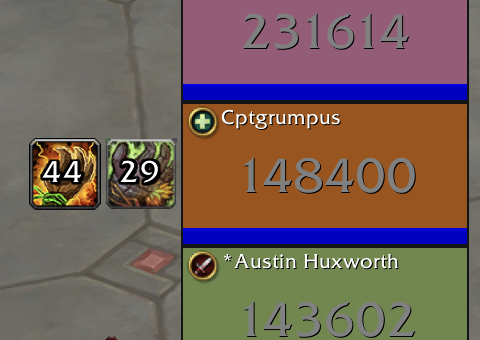
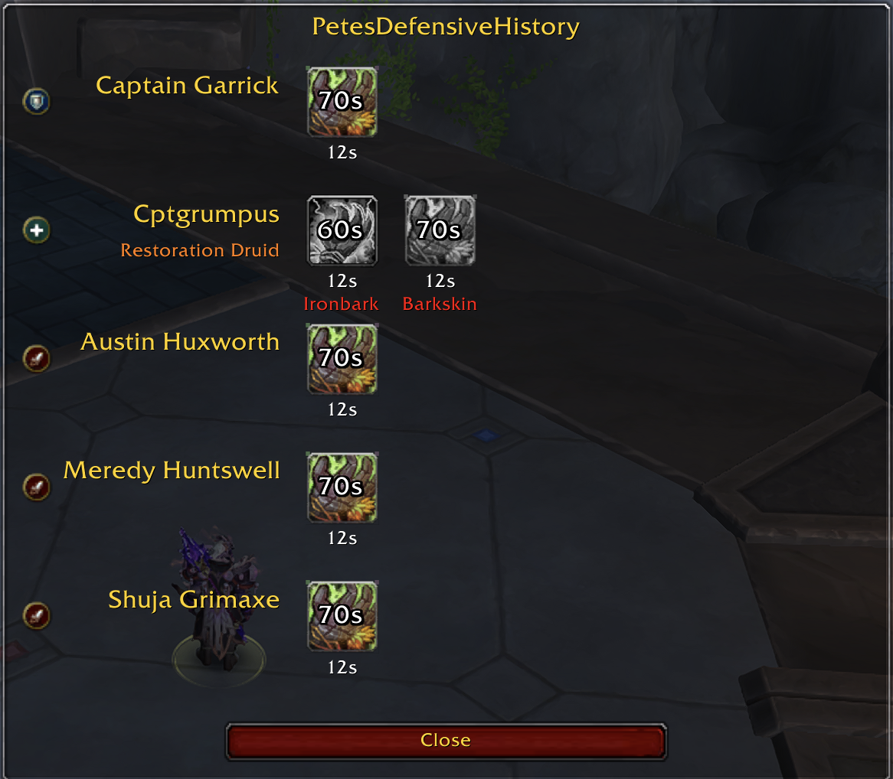

# PetesDefensiveHistory

Tracks cooldowns for Blizzard-approved `IMPORTANT`, `BIG_DEFENSIVE` and `EXTERNAL` buffs.

This is NOT an addon for general cooldown tracking, only buffs that appear on Blizzard's
raid frames are trackable.

Which cooldown has been used is guessed based on the small number of Blizzard marked buffs and some additional logic about who those buffs can be cast by and applied to. Since no exploits are used, tracking is not 100% accurate and varies depending on group composition. When a buff that appears on raid frames cannot be assigned to a specific ability, the addon falls back to history tray mode. Buffs added to the history tray get a count-up timer beginning from when the buff was first detected. Player knowledge can be used to know when the cooldown is available again (e.g., since Barkskin has a 60s cooldown, when the count-up timer reaches 60, Barkskin is available again).

**STILL A WORK IN PROGRESS.** Still does not automatically detect talents that change cooldown length, buff duration or number of charges, but support is coming soon.

### History tray fallback mode when cooldown is ambiguous
The default mode: when a big cooldown is used, keep the icon around (without knowing what it is) and attach a timer that counts up. Similar to a GCD tracker - is useful if the player knows the cooldown of the ability.

To reduce clutter, the count-up timer is removed when the longest possible cooldown across all abilities that could be present on that player is reached.

### Cooldown tracking when ability can be guessed
In some cases, the ability used can be guessed. For example, if the group has no external defensives and a spec has only one ability X that is classified as a BIG_DEFENSIVE, then any time a big defensive buff is shown it must be ability X.

### Group-wide solving which abilities can always be uniquely identified
Use `/pdh` to show which group members are valid targets for each ability in the group. Abilities that can always be guessed are colored, greyed out abilities can only sometimes be guessed.

